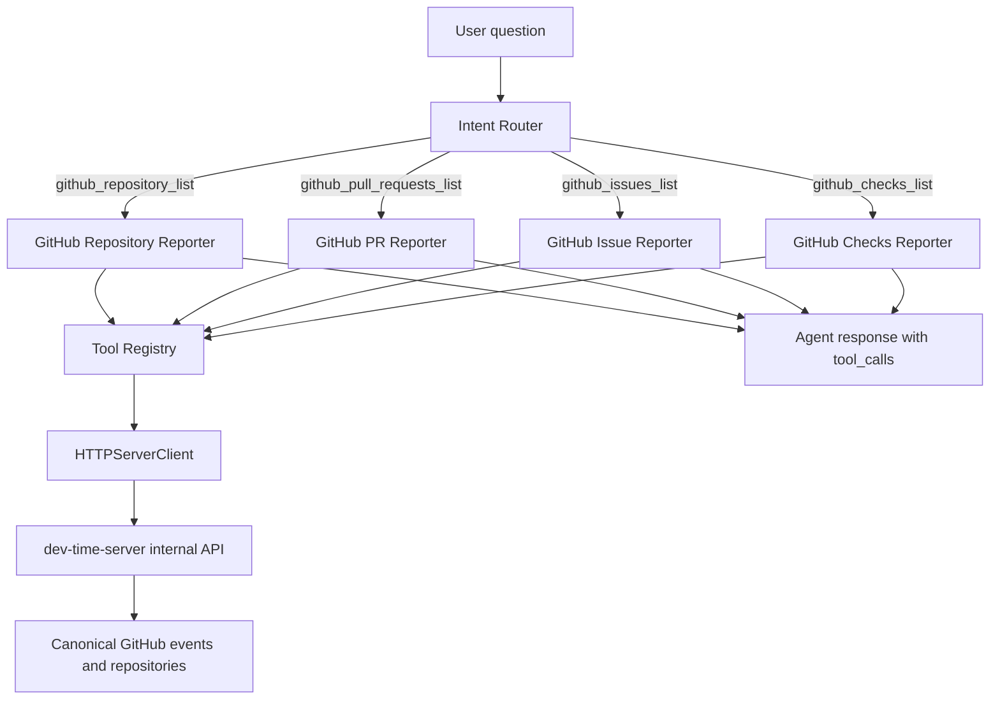

# GitHub 能力层架构

## 定位

GitHub 能力层是 `dev-time-agent` 访问 GitHub 事实的统一入口。它不是直接调用 GitHub API 的 SDK，也不是本地缓存层；它通过 `dev-time-server` internal API 读取已经授权、同步和归一化后的 GitHub 对象。

这样设计是为了解决三个问题：

- 权限集中：GitHub App installation、repository 权限、token 和 webhook 事实都由 `dev-time-server` 管理。
- 事实统一：Agent 看到的 repo、PR、Issue、Checks 必须和风险引擎看到的是同一批 server 事实，不能绕过 canonical source。
- 可追踪：每次 GitHub 对象读取都会记录 `tool_calls`、trace 和 evidence_refs，方便前端展示和回归测试。

## 当前能力范围

当前 `dev-time-agent` 已支持以下 GitHub 只读能力：

| 用户问题 | Intent | Tool |
| --- | --- | --- |
| 查看我的 GitHub 项目 | `github_repository_list` | `github.repos.list` |
| 查看某个仓库的 PR | `github_pull_requests_list` | `github.pull_requests.list` |
| 查看某个仓库的 Issue | `github_issues_list` | `github.issues.list` |
| 查看某个仓库的 CI / Checks | `github_checks_list` | `github.checks.list` |

补充工具：

- `github.auth.status`：检查 GitHub 授权和仓库可见范围。
- `risk_evidence.read`、`project_status.read`、`ci_checks.read`、`pull_request.read`：围绕当前风险评估读取 EvidenceBundle 相关事实。
- `action_suggestion.create`：创建待用户确认的行动草稿，不直接写 GitHub。

## 分层结构



## 执行流程

### 1. 意图识别

`conversation.py` 先把用户问题归类。和 GitHub 对象相关的问题不会默认进入风险解释，而是进入专门的 GitHub intent：

- `查看我的 github 项目` -> `github_repository_list`
- `查看 dev-time-agent 的 PR` -> `github_pull_requests_list`
- `查看 dev-time-agent 的 issue` -> `github_issues_list`
- `查看 dev-time-agent 的 CI` -> `github_checks_list`

这一步解决的是“用户要查 GitHub 对象，却被 Agent 反问风险/证据/行动计划”的问题。

### 2. 仓库定位

PR、Issue、Checks 查询先调用 `github.repos.list`，再从用户消息里匹配 `full_name` 或 `name`。如果只授权了一个仓库，则默认使用唯一仓库；如果无法匹配，则明确要求用户补充仓库名。

这一步解决的是“用户说 dev-time-agent，但系统不知道对应 repository_id”的问题。

### 3. 对象读取

工具层通过 `HTTPServerClient` 调用 server internal API：

```text
GET /internal/github/repositories
GET /internal/github/repositories/{repositoryID}/pull-requests
GET /internal/github/repositories/{repositoryID}/issues
GET /internal/github/repositories/{repositoryID}/checks
```

Agent 只拿到 server 返回的结构化对象和 evidence_refs，不接触 GitHub token，也不直接请求 github.com。

### 4. 回答生成

fallback reporter 会把对象列表格式化为用户可读文本，并写入：

- `intent`
- `current_node`
- `tool_calls`
- `trace_events`
- `evidence_refs`

LLM 路径也必须通过 Tool Layer 获取 GitHub 对象，不能凭空回答“我能看到哪些项目”。

## 和风险层的关系

GitHub 能力层不是替代风险层，而是给 Agent 补齐对象读取能力：

- 风险层回答“为什么高风险”“阻塞在哪里”“下一步怎么做”。
- GitHub 能力层回答“有哪些仓库”“某仓库有哪些 PR / Issue / Checks”。
- 两者共享同一事实源：`dev-time-server` 的 GitHub repository、event store、risk assessment 和 EvidenceBundle。

当用户问“这个 PR 为什么高风险”时，仍应走风险证据链；当用户问“查看这个仓库的 PR”时，应走 GitHub 对象读取链路。

## 安全边界

- Agent 不保存 GitHub token。
- Agent 不直接调用 GitHub API。
- Agent 不直接执行 GitHub 写入。
- 写操作只能生成 `ActionSuggestion` 草稿，并等待用户确认。
- server 负责 repository 权限、installation 权限和 allowed actions 校验。
- private repo 的完整内容不能被日志、trace 或 memory 非必要保存。

## 当前缺陷

- GitHub intent 仍是关键词规则为主，复杂表达需要更强的 intent eval 覆盖。
- 仓库定位只支持名称匹配，尚未支持别名、最近上下文仓库、自然语言 disambiguation。
- 当前只覆盖 repo、PR、Issue、Checks，还没有覆盖 commits、branches、releases、milestones、workflow runs、review comments、labels 和 assignees。
- reporter 有重复逻辑，后续对象类型变多后应抽成通用 GitHub object list reporter。
- LLM planner 的 GitHub tool forcing 当前主要覆盖 repository access，后续需要覆盖 PR、Issue、Checks 等对象级工具。

## 后续规划

### P0：补齐核心 GitHub 对象读取

- `github.commits.list`
- `github.branches.list`
- `github.releases.list`
- `github.milestones.list`
- `github.workflow_runs.list`
- `github.review_comments.list`

目标是让 Agent 能回答“这个项目最近发生了什么”“哪条分支有风险”“哪个 milestone 偏离计划”。

### P1：统一 GitHub Object Schema

引入统一对象协议：

```json
{
  "object_type": "pull_request",
  "object_ref": "repo_1002#18",
  "title": "Add GitHub tool layer",
  "state": "open",
  "url": "https://github.com/owner/repo/pull/18",
  "evidence_ref": "event_pull-request-18"
}
```

目标是让不同 GitHub 对象能进入同一套列表、摘要、引用和 UI 展示逻辑。

### P2：上下文感知仓库定位

- 记住上一轮用户查询的 repository_id。
- 支持“这个仓库”“刚才那个项目”的短追问。
- 多仓库匹配时返回候选项，而不是直接失败。

### P3：GitHub intent eval

新增专门评估集，覆盖：

- repo list
- PR list
- Issue list
- Checks list
- 风险解释 vs GitHub 对象查询的边界
- 需要澄清的多仓库歧义

每次修改 prompt、classifier 或 tool catalog，都必须跑 GitHub intent regression。

## 面试讲法

可以这样描述：

> 我没有让 Agent 直接拿 GitHub token 调 API，而是做了一层 GitHub Tool Layer。Agent 先做意图识别，判断用户是在问风险解释还是在查 GitHub 对象；如果是查对象，就通过 Tool Registry 调 `dev-time-server` internal API。server 是唯一事实源，负责 GitHub App 权限、对象同步和事件归一化。Agent 只拿结构化结果和 evidence_refs，并把工具调用写入 trace。这样能保证权限安全、事实一致，也方便做 eval 和回归测试。

如果被追问为什么这样定义是解决问题：

> 之前“查看我的 GitHub 项目”会被当成风险澄清，因为 Agent 没有对象级 GitHub 能力。现在 repo、PR、Issue、Checks 都有明确 intent、工具和 reporter，用户查对象时不会被强行带到风险解释；需要风险分析时又能回到 EvidenceBundle 证据链。这是把“GitHub 事实查询”和“风险推理”拆开，但仍共享同一个 server 事实源。
# 2026-07 Risk Episode capability binding

Risk-scoped GitHub read capabilities 不再以 `github.repos.list` 作为默认起点：

- Issue/PR/Checks 使用 Trusted Risk Context 中的 repository ID。
- PR 失败诊断使用 Risk Episode 中的 PR、head SHA 与 check run ID。
- `github.checks.logs` 的输入必须与 Risk Episode 绑定对象一致。
- PageContext 和模型输出都不能覆盖这些 tool arguments。
