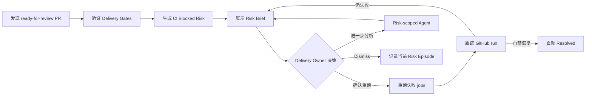
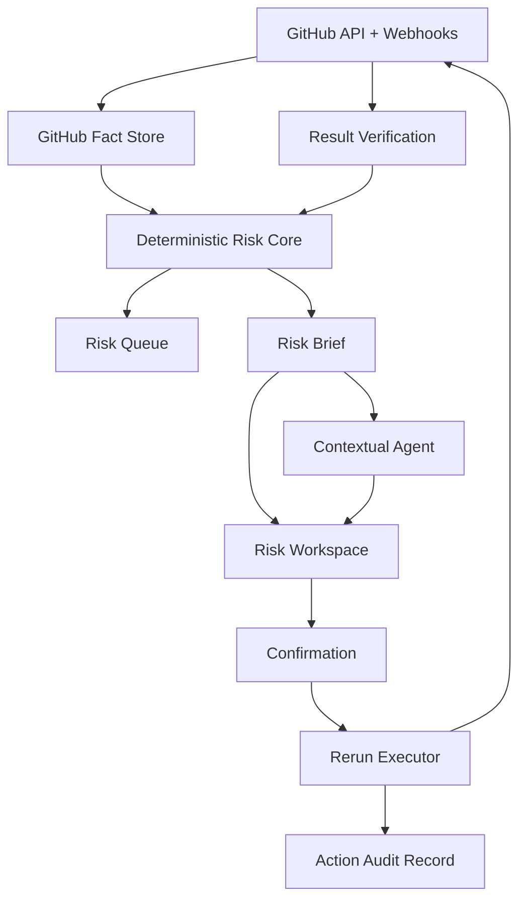

# Dev Time 产品功能定义

## 1. 产品定位

Dev Time 是面向独立开发者和小团队技术负责人的 **GitHub CI 交付风险工作区**。

它持续验证 GitHub Pull Request 的交付门禁，把真正影响合并的 CI 阻塞整理为有证据、可排序、可行动的 Risk Queue，并帮助 Delivery Owner 安全地重新运行失败任务，直到 GitHub 事实确认阻塞解除。

Dev Time 不是通用 GitHub 聊天机器人、项目管理工具、CI 平台替代品或自治编码 Agent。Agent 是风险解释与修复建议能力，不是产品入口，也不是风险事实来源。

## 2. 目标用户与核心任务

**目标用户：Delivery Owner**

对一个或多个 GitHub 仓库的交付结果负责，并需要决定当前优先处理什么的人。首个 MVP 为单用户私有 Workspace，服务独立开发者或小团队中的技术负责人本人。

**核心任务**

> 打开 Dev Time，不输入问题，就能知道当前哪个 Merge Target 被 CI 阻塞、证据是什么、为什么现在需要处理，以及最小下一步是什么。

**核心结果指标**

Time to Verified Unblock（TTVU）：从首次检测到 Gate Failure，到 GitHub 证据确认相关 Delivery Gates 全部恢复通过的时间。

## 3. MVP 范围

首个 MVP 只验证一条端到端闭环：

Milestone Target 和 Release Target 保留为未来产品模型，但不属于首个 MVP。

## 4. 核心领域模型

| 对象 | 定义 | MVP 行为 |
|---|---|---|
| Personal Risk Workspace | 一个 GitHub 身份独占的私有工作区 | 所有凭据、仓库、风险和操作记录按 Workspace 隔离 |
| Connected Repository | 用户主动加入并授权同步的 GitHub 仓库 | 未主动加入的仓库不读取、不监控 |
| Merge Target | 非 Draft、已 ready-for-review 的 Pull Request | 首个 MVP 唯一的 Delivery Target |
| Delivery Gate | 合并前必须通过的 GitHub check/workflow | 来自 branch protection、ruleset 或用户主动指定 |
| Risk Episode | `Merge Target + head SHA + 风险类型` 标识的一次风险事件 | 新 commit 或风险重新出现时创建新事件 |
| CI Blocked Risk | 一个 Merge Target 因一个或多个门禁未通过形成的聚合风险 | 每个 Merge Target 在队列中最多一条，详情聚合失败门禁 |
| Risk Brief | 风险的结构化、可追溯说明 | 不依赖 LLM 生成 |
| Confirmed Rerun | 用户查看具体范围后批准的一次 GitHub Actions 重跑 | MVP 唯一可执行写操作 |

完整业务词汇以 [`CONTEXT.md`](../CONTEXT.md) 为准。

## 5. 用户功能

### 5.1 登录与 Workspace

- 使用 GitHub 身份登录。
- 未登录状态不能读取仓库、设置、风险或示例生产数据。
- 一个用户对应一个 Personal Risk Workspace。
- 首版不支持邀请成员、角色权限、共享确认状态或任务分配。
- Demo 数据只能存在于明确标识且与真实数据隔离的 Demo Workspace。

### 5.2 仓库接入与门禁配置

- 用户从 GitHub 授权身份可访问的仓库中主动选择 Connected Repositories。
- Dev Time 自动读取 branch protection 和 ruleset 中的必要检查。
- 已明确要求的检查自动成为 Delivery Gates。
- 未发现必要检查时，仓库进入 `Needs Setup`，用户必须主动选择合并前必须通过的 workflow/check。
- 至少存在一个有效 Delivery Gate 后，仓库才能进入 `Monitoring`。
- `Needs Setup` 不能显示“无风险”或绿色健康状态。

### 5.3 GitHub 事实同步

- 首次同步完成前不展示 Risk Queue 结论。
- GitHub webhook 是主要更新来源。
- 每 15 分钟 reconciliation 一次，修复 webhook 丢失或乱序。
- 每条证据保存 GitHub 对象标识、状态、head SHA、观测时间和验证时间。
- Monitoring 仓库超过 20 分钟没有成功验证 GitHub 状态时进入 `Stale`。
- Stale 时保留已有风险，但禁止展示 All Clear，禁止自动 Resolved。

### 5.4 Delivery Gate 运行基线

- 同一仓库、同一 Delivery Gate 使用最近 20 次成功运行计算基线。
- 至少 5 次成功样本后，停滞阈值为 `max(30 分钟, 历史 P95 × 2)`。
- `queued` 或 `in_progress` 超过阈值时判定为 Stalled Gate。
- 样本不足时，运行超过 30 分钟只能进入 Watch。
- GitHub 明确返回失败结论时立即生成 Gate Failure，不等待停滞阈值。

### 5.5 Risk Queue

Risk Queue 的第一层对象是 Delivery Risk，不是 Project 或 Repository。

- 一个 Merge Target 多个门禁失败时，只显示一条 CI Blocked Risk。
- 按 `Now → Next → Watch` 分组，不向用户展示 0–100 风险分。
- Now：CI 是当前 GitHub 可见的直接交付阻塞。
- Next：门禁已失败，但 review、merge conflict 等更早前提尚未满足。
- Watch：可能停滞，但证据或历史样本尚不足。
- 当前置条件变化使 CI 成为直接阻塞时，Next 自动升级为 Now。
- 每次优先级变化都必须展示原因。
- Workspace 显示自上次访问以来新增或升级为 Now 的风险数量，不发送外部通知。

### 5.6 Risk Brief

每条风险必须在 Agent 不可用时仍能展示以下内容：

- 受影响的仓库、PR、head SHA 和 Merge Target；
- 当前阻塞及聚合的失败 Delivery Gates；
- GitHub 证据、来源链接和 `last verified at`；
- Now / Next / Watch 的具体判断原因；
- 风险状态与历史变化；
- 一个明确的最小下一步；
- 可执行操作的准确范围。

### 5.7 风险生命周期

- `Open`：系统检测到风险，用户尚未确认处理。
- `Acknowledged`：用户已看到并决定处理，GitHub 风险条件仍存在。
- `Resolved`：仅当最新 GitHub 证据确认门禁恢复时自动进入。
- `Dismissed`：用户将当前 Risk Episode 判断为误报、已接受风险或与当前交付无关。

Dismiss 必须记录原因，只作用于当前 head SHA 对应的 Risk Episode。新 commit、风险恢复后再次出现或失败门禁集合实质变化时，需要创建新的 Open Risk。Dismiss 不能关闭 Delivery Gate。

### 5.8 Confirmed Rerun

- 默认使用 GitHub 的 re-run failed jobs。
- 确认界面展示仓库、PR、workflow、失败 jobs 和实际执行范围。
- 如果只能重跑整个 workflow，明确提示范围扩大并要求再次确认。
- 同一 workflow run 正在重跑时重复请求必须幂等，不创建第二次执行。
- 操作记录包含发起人、目标、GitHub run ID、确认时间、范围、结果和错误。
- 执行失败时风险保持 Open 或 Acknowledged。
- 请求成功不等于风险解除；必须持续跟踪 GitHub 结果，全部门禁恢复后才 Resolved。

### 5.9 Contextual Agent

- 只能从某个 Risk Brief 进入，没有全局 Chat 首页。
- 每次对话绑定单个 Risk Episode。
- 自动获得 PR、head SHA、失败门禁、job 日志和该风险历史。
- 回答引用具体 GitHub 证据，明确区分事实与推断。
- 可以解释失败、比较历史运行、回答追问并生成修复步骤。
- 证据不足时明确说明无法判断。
- Agent 不决定风险是否存在，不改变确定性优先级，不执行 GitHub 写操作。
- 旧 Risk Episode 的对话只作为历史保留。

### 5.10 可验证空状态

只有以下条件全部成立才能显示 All Clear：

- 至少一个仓库处于 Monitoring；
- 首次同步完成；
- 所有监控数据均未 Stale；
- 当前不存在 Open 或 Acknowledged 的 CI Blocked Risk。

All Clear 必须显示已检查的活跃 Merge Targets、Delivery Gates 数量与最后验证时间。`Needs Setup`、`Stale` 和“没有活跃 Merge Target”使用各自的状态，不得显示为 All Clear。

## 6. 确定性核心与 Agent 边界

Delivery Risk、Attention Priority、Risk Lifecycle 和 Risk Brief 必须由 GitHub 事实与可解释规则生成。Agent 故障只能降低解释能力，不能让 Risk Workspace 失效。该边界由 [`ADR-0001`](adr/0001-deterministic-risk-core.md) 固定。

## 7. 首个 MVP 不包含

- 项目级风险分、项目排行榜和手动项目状态管理；
- 全局 Chat、跨仓库通用问答和提问前强制风险评估；
- Agent plan、tool call、memory、run timeline 等面向用户的技术轨迹；
- Confirmed Rerun 之外的 GitHub 写操作；
- 自动推送代码、修改或合并 PR、发表评论、关闭 Issue；
- Milestone Target、Release Target 和通用仓库健康管理；
- 团队成员、角色、评论、分配和共享状态；
- 邮件、Slack、Teams 或其他外部通知；
- 未标识的示例数据、硬编码 fallback 项目和假同步；
- 仅修改本地数据库状态、没有 GitHub 执行证据的“成功”。

## 8. MVP 验收标准

1. 匿名请求无法读取任何真实 Workspace 数据。
2. 用户只能添加 GitHub 授权范围内的仓库，且数据按 Workspace 隔离。
3. 没有 Delivery Gate 的仓库显示 Needs Setup，不能显示零风险。
4. 首次同步读取真实 GitHub PR、门禁、run 和 job 事实；同步时间代表事实验证时间。
5. 同一 Merge Target 的多个失败门禁聚合为一条 CI Blocked Risk。
6. Now / Next / Watch 的结果可由确定性输入复现，并显示判断理由。
7. LLM/Agent 下线时，Risk Queue、Risk Brief 和生命周期仍完整可用。
8. Stale 数据不能产生 All Clear 或自动 Resolved。
9. Confirmed Rerun 显示准确范围、要求确认、具备幂等性并产生 Action Audit Record。
10. GitHub 请求成功不直接改变风险为 Resolved；只有门禁恢复证据可以解除风险。
11. Agent 回答绑定 Risk Episode、引用证据且不执行未授权写操作。
12. 产品不暴露项目风险分、全局 Chat、假同步或本地伪成功路径。

## 9. 度量

首轮内测先建立基线，不预设缺乏证据的目标值。

- **TTVU**：风险从首次检测到 GitHub 验证解除的时间；
- **Detection Latency**：GitHub 失败到 Dev Time 创建风险的时间；
- **False-positive Dismiss Rate**：因误报被 Dismiss 的风险比例；
- **Confirmed Rerun Resolution Rate**：确认重跑后最终恢复通过的比例；
- **Fresh Monitoring Coverage**：未进入 Stale 的 Monitoring 仓库比例。

这些指标衡量真实交付效果与可信度，不使用 Agent 调用数、聊天消息数或功能数量作为产品成功指标。
