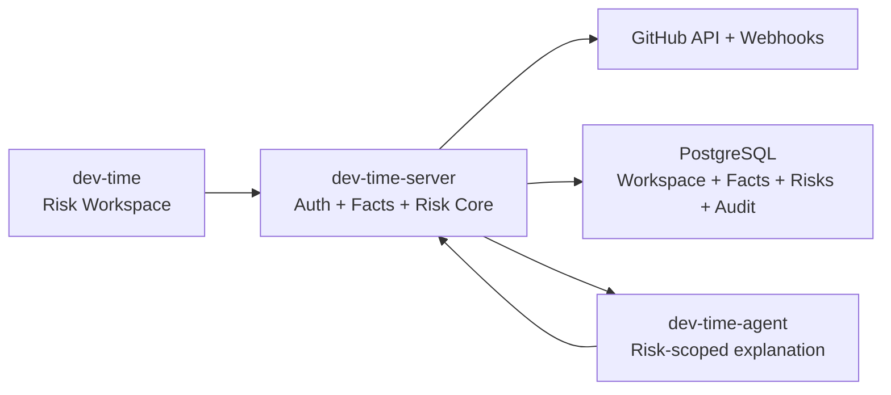
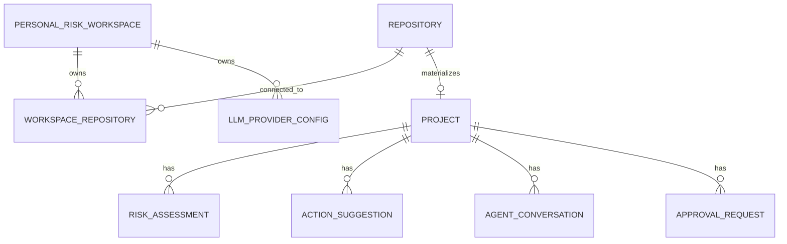
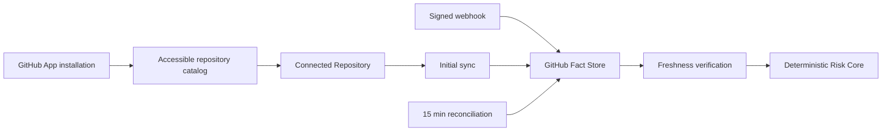
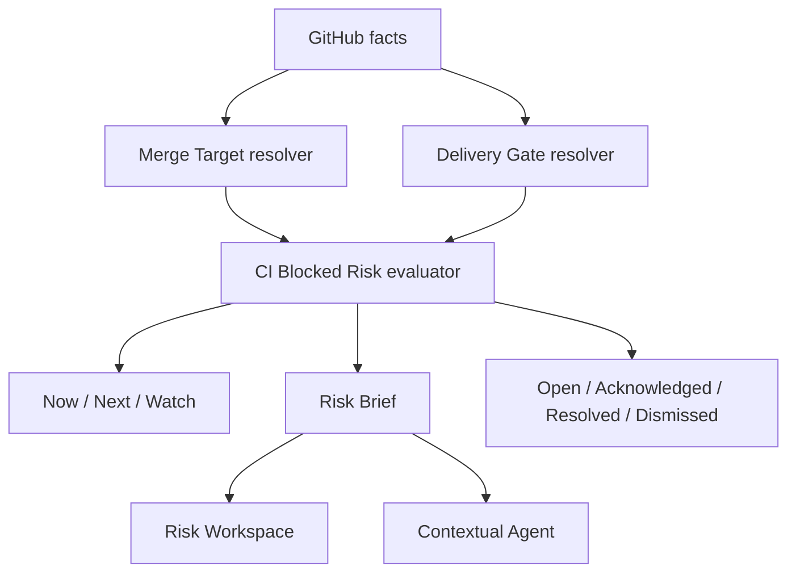
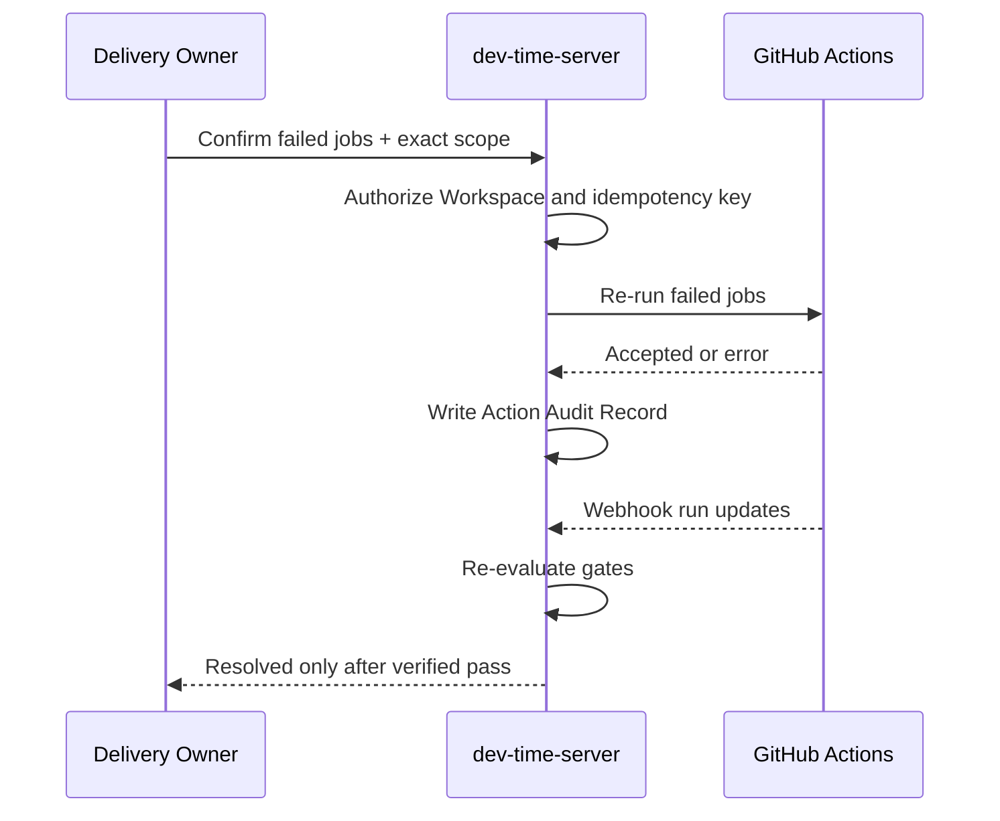

# Dev Time 技术架构

## 架构目标

Dev Time 的首个 MVP 是一个 GitHub CI 交付风险工作区：对已认证 Delivery Owner 主动连接的仓库持续验证 Merge Target 的 Delivery Gates，生成可复现的 CI Blocked Risk，并在用户确认后重跑失败 jobs，直到 GitHub 事实确认风险解除。

核心系统不能依赖 LLM 才能工作。Risk Queue、Risk Brief、优先级、生命周期和解除判断都由 GitHub 事实与确定性规则产生；Contextual Agent 只解释证据和生成修复建议。

## 三服务边界

- `dev-time`：身份入口、仓库接入、Risk Queue、Risk Brief、确认交互和 Risk-scoped Agent UI；不持有 GitHub token 或 LLM key 明文。
- `dev-time-server`：Personal Risk Workspace、GitHub App、事实存储、Delivery Gate 配置、确定性风险核心、执行确认、GitHub 写操作和审计记录。
- `dev-time-agent`：按 Risk Episode 接收证据上下文，解释失败并生成修复建议；不维护 canonical 风险状态，不决定优先级，不直接执行 GitHub 写入。

## Personal Risk Workspace 数据边界

一个已验证 GitHub user id 只解析为一个 `workspace_github_<user-id>`。所有用户态资源必须从请求 session 中解析 Workspace，不接受前端传入 workspace id 作为授权依据。

安全规则：

1. 匿名用户只能访问登录入口、OAuth callback、GitHub App installation callback、签名 webhook 和健康检查。
2. GitHub App installation state 必须签名、限时，并绑定发起安装的 GitHub 身份；callback 使用该身份登记可访问仓库。
3. `/api/projects` 及项目、risk assessment、conversation、action、approval、repository settings、LLM settings 的读写必须验证 Workspace 归属。
4. 跨 Workspace 访问返回 404，避免泄露资源是否存在。
5. Demo 数据只能位于显式 Demo Workspace；生产 UI 不允许硬编码或 fallback 项目。

## GitHub 事实流

- GitHub webhook 是主要更新来源，reconciliation 修复丢失和乱序。
- GitHub API 响应、对象 id、head SHA、观测时间和验证时间构成风险证据。
- 首次同步完成前不能生成 All Clear；Monitoring 超过 20 分钟未验证进入 Stale。
- Repository catalog 与 Connected Repository 分离：授权可见不等于已加入监控。

## 确定性风险核心

- 一个 Merge Target 的多个失败门禁聚合为一条 CI Blocked Risk。
- Now / Next / Watch 由当前交付前提、门禁结论、证据可信度和新鲜度决定，不向用户展示项目风险分。
- `Merge Target + head SHA + risk type` 标识 Risk Episode。
- 只有最新 GitHub 证据确认门禁恢复时才能自动 Resolved。
- Agent 不可用时 Risk Queue、Risk Brief 和生命周期仍完整可用。

## Confirmed Rerun

Confirmed Rerun 是首个 MVP 唯一允许的 GitHub 写操作。请求被 GitHub 接受不等于风险解除；重复确认同一正在执行的 run 不得创建第二次执行。

## Contextual Agent 协议

Agent 请求必须绑定 Risk Episode，并携带结构化 Risk Brief、PR/head SHA、失败门禁、相关 job 日志和证据引用。输出把事实、推断与建议分开；证据不足时明确无法判断。

允许：解释失败、比较历史运行、回答风险追问、生成修复步骤。

禁止：创建或改变 Delivery Risk、调整确定性优先级、自动重跑、推送代码、合并 PR、评论或关闭 GitHub 对象。

## API 分层

- 公共边界：`/healthz`、GitHub OAuth start/callback、installation callback、签名 webhook。
- Workspace API：`/api/projects`、repository settings、risk、evidence、conversation、action、approval、LLM settings；全部经过 session 和资源归属验证。
- Internal API：仅供受信任的 Agent Runtime/worker 使用，不通过公网 Nginx 暴露；后续必须使用服务间凭据并从 job/risk 解析 Workspace。

前端所有 Workspace 请求使用 cookie session，并显式设置 `credentials: include`。认证失败时只渲染产品介绍与 GitHub 登录入口；认证成功但无 Connected Repository 时渲染可操作的 GitHub 接入空状态。

## 数据与密钥

- PostgreSQL 保存 Workspace 归属、GitHub facts、风险状态、Action Audit Record 和用户设置。
- GitHub installation token、OAuth secret、webhook secret 和 LLM API key 只在服务端安全边界内使用。
- LLM Provider 配置以 Workspace + provider 唯一，API 只返回是否配置和 key 后四位，不回传明文。
- 用户态审计记录必须保存 actor Workspace、目标 GitHub 对象、确认范围、时间、结果和错误。

## 演进顺序

1. Personal Risk Workspace 与身份隔离。
2. Verified CI Blocked Risk 与 Delivery Gate 模型。
3. Explainable Risk Queue 与 Risk Brief。
4. Risk lifecycle、freshness 与 Stalled Gate baseline。
5. Confirmed Rerun 与结果验证。
6. Risk-scoped Agent、指标和旧产品入口下线。

任何新功能若不能缩短或更可靠地衡量 Time to Verified Unblock，默认不进入首个 MVP。
